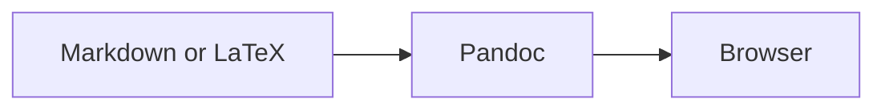
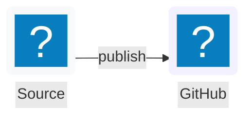

# pi-md-preview

`pi-md-preview` is a standalone, editor-agnostic CLI for high-fidelity Markdown and LaTeX preview in a web browser. It uses Pandoc for document syntax and MathML, then adds readable light/dark styling, syntax highlighting, Mermaid, selective MathJax fallback, local resources, and save-based live reload.

It has no Pi or Zed runtime dependency. Zed is one convenient client; any terminal or editor task can run it.


## Prerequisites

- [Node.js](https://nodejs.org/) 22 or newer
- [Pandoc](https://pandoc.org/) on `PATH`

Install Pandoc on macOS with:

```bash
brew install pandoc
```

On Debian/Ubuntu, use `sudo apt install pandoc`. On Windows, use `winget install --id JohnMacFarlane.Pandoc`. If Pandoc is installed elsewhere, set `PANDOC_PATH` to the executable.

## Install from a local checkout

```bash
git clone git@github.com:omaclaren/pi-md-preview.git
cd pi-md-preview
npm install
npm run build
npm link
```

The checkout is currently private, and the package has `"private": true`; it is not published to npm. `npm link` exposes the local compiled executable as `pi-md-preview`.

Without linking, run the compiled CLI directly:

```bash
node dist/cli.js --no-open README.md
```

## Usage

```text
pi-md-preview [options] <file>
pi-md-preview --watch [options] <file>
pi-md-preview <file> --watch
```

| Option | Meaning |
|---|---|
| `-w, --watch` | Start a live preview server and re-render after saved changes |
| `--no-open` | Do not launch a browser; print the generated path or preview URL |
| `--theme auto\|light\|dark` | Browser theme; default `auto` follows `prefers-color-scheme` |
| `--format auto\|markdown\|latex` | Input format; default `auto` uses the file extension |
| `--font-size <px>` | Base document font size from 10 to 24; default 15 |
| `--port <number>` | Watch-server port; `0` or omission chooses an available port |
| `-h, --help` | Show help |
| `-v, --version` | Show the version |

Automatic format detection recognizes common Markdown extensions (`.md`, `.markdown`, `.mdown`, `.mkd`, `.qmd`, and `.rmd`) and standalone LaTeX (`.tex` and `.latex`). Use `--format` for another extension.

### One-shot preview

```bash
pi-md-preview notes.md
pi-md-preview paper.tex --theme light --font-size 16
```

One-shot mode renders an HTML file in a bounded user cache and opens it in the system default browser. It reuses a stable cache path for the same input/options and keeps at most 30 generated HTML files.

For headless or SSH use:

```bash
pi-md-preview --no-open notes.md
# HTML: /path/to/cache/<id>.html
```

### Watch mode

```bash
pi-md-preview --watch notes.md
pi-md-preview notes.md --watch --theme auto
pi-md-preview --watch --no-open --port 0 notes.md
```

Watch mode:

- opens one browser tab at startup and updates that tab through server-sent events (SSE);
- handles ordinary writes and editor atomic-save/rename patterns;
- debounces rapid saves;
- preserves the nearest stable heading/block anchor, with scroll ratio as a fallback;
- keeps the last successful document visible when a later render fails;
- shows the current error in the browser and terminal, then recovers after a corrected save; and
- closes the watcher, SSE clients, and HTTP server on Ctrl-C or SIGTERM.

Watching is **save-based**. It reads the file on disk and cannot see an editor's unsaved buffer. Enabling editor autosave makes updates feel more immediate. If the initial watch render fails, the CLI serves an error page and remains active, so a subsequent save can recover; if it is stopped before any successful render, it exits nonzero.

## Rendering examples

### Math

All of these forms are supported in Markdown:

```markdown
Inline dollar math: $E = mc^2$.

Inline parenthesized math: \(a^2 + b^2 = c^2\).

$$
\int_0^1 x^2\,dx = \frac{1}{3}
$$

\[
\mathbf{A}\mathbf{x} = \mathbf{b}
\]
```

Pandoc emits native MathML where it can. If Pandoc leaves unsupported TeX as a `.math` fallback span, the browser loads MathJax selectively rather than typesetting the whole document with JavaScript.

### Mermaid

````markdown

````

Mermaid is loaded only when a `mermaid` fence is present.

Flowcharts also support `lucide:*` and `logos:*` icon nodes. Keep each icon metadata declaration on one source line:

````markdown

````

The browser loads icon-pack JSON lazily from unpkg only when a diagram references that prefix. It adjusts icon and node-label colors against their rendered backgrounds for readable light and dark previews. If Mermaid or an icon pack cannot load, the page shows an error alongside the original diagram source.

### Local resources and Obsidian images

Relative paths resolve from the source document's directory:

```markdown


![[figures/result.png|Obsidian-style caption]]
```

Absolute local image paths are also supported. In watch mode, in-directory paths go through the restricted resource endpoint; explicitly referenced absolute files outside that directory receive opaque, per-render allowlisted URLs. Browser resource URLs include a render revision and use `Cache-Control: no-store`, so saved image changes do not remain stale.

### Standalone LaTeX

A `.tex` or `.latex` file is read as a complete LaTeX document:

```latex
\documentclass{article}
\usepackage{amsmath}
\begin{document}
\section{Example}
Inline math $x^2$ and display math
\[
  \int_0^1 x^2\,dx = \frac{1}{3}.
\]
\end{document}
```

Previewing LaTeX does not run a TeX engine; Pandoc converts supported document structure and equations directly to HTML5/MathML.

## Zed task

After installing or linking the CLI, add this valid task definition to `.zed/tasks.json` in a project (or to Zed's global tasks file):

```json
[
  {
    "label": "Preview current Markdown/LaTeX file",
    "command": "pi-md-preview",
    "args": ["--watch", "$ZED_FILE"],
    "cwd": "$ZED_WORKTREE_ROOT",
    "use_new_terminal": true,
    "allow_concurrent_runs": false,
    "reveal": "always",
    "save": "current"
  }
]
```

Run **Preview current Markdown/LaTeX file** from Zed's task picker. The watcher sees disk saves; enabling Zed autosave makes the preview feel closer to buffer-live.

## Other editor and terminal integrations

Any editor that can run a shell task can use the same command:

```bash
pi-md-preview --watch "/absolute/path/to/current-file.md"
```

Examples:

- a VS Code task can pass `${file}`;
- a Vim/Neovim command can pass the current buffer's expanded filename after writing it;
- an SSH session can use `--watch --no-open`, then forward the printed port if browser access is needed remotely;
- scripts and CI checks can use one-shot `--no-open` without launching a GUI.

The server intentionally binds to `127.0.0.1`, so remote access requires an explicit tunnel such as `ssh -L`.

## Network and offline behavior

Pandoc rendering, styling, native MathML, syntax highlighting, resource serving, and live reload are local. The generated browser page uses external CDNs for optional enhancements:

- Mermaid 11.16 from jsDelivr, only when Mermaid blocks exist;
- Lucide and Logos icon-pack JSON from unpkg, loaded lazily only when a diagram references those packs;
- MathJax 3 from jsDelivr, only when Pandoc could not produce MathML for an equation.

Automated tests do not contact these CDNs. Without network access, ordinary documents and MathML still render; Mermaid remains readable as source code with an in-page error, and unsupported equations remain as TeX with a warning. Fully bundled Mermaid/MathJax/icon packs are outside the first milestone.

## Security model

Watch mode:

- listens on IPv4 loopback (`127.0.0.1`) only;
- uses a random 192-bit token in every preview route;
- sends `no-store`, `nosniff`, no-referrer, same-origin, and content-security headers;
- serves relative resources only after lexical and canonical (`realpath`) containment checks;
- rejects plain, URL-encoded, and repeatedly encoded `..` traversal, absolute resource-endpoint paths, directories, and symlinks escaping the source directory; and
- exposes out-of-root absolute files only when the current successful document explicitly references them, through opaque IDs with no arbitrary-path API.

A failed re-render does not replace either the previous HTML or its resource allowlist.

## Troubleshooting

### Pandoc was not found

Confirm installation:

```bash
pandoc --version
```

Or select a binary explicitly:

```bash
PANDOC_PATH="/custom/path/pandoc" pi-md-preview notes.md
```

The CLI validates Pandoc before starting and exits nonzero when it is unavailable.

### The browser did not open

Use `--no-open` and open the printed HTML path or URL manually:

```bash
pi-md-preview --no-open notes.md
pi-md-preview --watch --no-open notes.md
```

The CLI uses the operating system default-browser command (`open`, `xdg-open`, or Windows `start`); it does not hard-code a browser.

### A local image is missing

- Check the path relative to the source file, not the shell's current directory.
- Put paths containing spaces or parentheses in Markdown angle brackets.
- In watch mode, a relative symlink whose target is outside the document directory is deliberately blocked; use an explicit absolute path if that file should be allowlisted.
- Save the image and source file. Resource responses are not browser-cached.

### The selected port is busy

Omit `--port` or use `--port 0` to let the operating system choose an available loopback port.

## Development

```bash
npm install
npm run typecheck
npm test
npm run build
```

The test suite uses Node's test runner and real Pandoc integration. It does not open a browser or require public-network access. Coverage includes CLI parsing, Markdown/LaTeX rendering, all required math delimiters, syntax highlighting, Mermaid icon wiring, local resources, watch startup, SSE revisions, atomic saves, render-error recovery, traversal/symlink defenses, and clean shutdown.

A representative fixture is available at [`test/fixtures/sample.md`](test/fixtures/sample.md), with a standalone LaTeX companion at [`test/fixtures/sample.tex`](test/fixtures/sample.tex).

For a manual headless smoke test:

```bash
node dist/cli.js --watch --no-open test/fixtures/sample.md
```

Fetch the printed loopback URL, save an edit to the fixture or a temporary copy, and observe the revision change. Press Ctrl-C to stop it.

## License

MIT. The rendering palettes and selected normalization/browser-preview patterns were adapted from the MIT-licensed [`pi-markdown-preview`](https://github.com/omaclaren/pi-markdown-preview) implementation; see [`LICENSE`](LICENSE).
