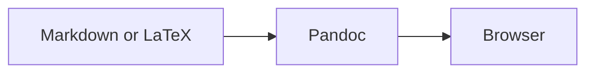
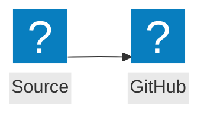

# pandoc-glance

`pandoc-glance` renders Markdown and LaTeX files as good-looking pages in your browser. Add `--watch` to refresh the page whenever you save.


## Prerequisites

- [Node.js](https://nodejs.org/) 22 or newer
- [Pandoc](https://pandoc.org/) on `PATH`

Install Pandoc on macOS with:

```bash
brew install pandoc
```

On Debian/Ubuntu, use `sudo apt install pandoc`. On Windows, use `winget install --id JohnMacFarlane.Pandoc`. If Pandoc is installed elsewhere, set `PANDOC_PATH` to the executable.

## Install

```bash
npm install --global pandoc-glance
```

## Usage

```text
pandoc-glance [options] <file>
pandoc-glance --watch [options] <file>
pandoc-glance <file> --watch
```

| Option | Meaning |
|---|---|
| `-w, --watch` | Start a live preview server and re-render after saved changes |
| `--no-open` | Do not launch a browser; print the generated path or preview URL |
| `--theme auto\|light\|dark` | Browser theme; default `auto` follows `prefers-color-scheme` |
| `--format auto\|markdown\|latex` | Input format; default `auto` uses the file extension |
| `--font-size <px>` | Base document font size from 10 to 24; default 15 |
| `--port <number>` | Watch-server port; `0` or omission chooses an available port |
| `-h, --help` | Show help |
| `-v, --version` | Show the version |

Automatic format detection recognizes common Markdown extensions (`.md`, `.markdown`, `.mdown`, `.mkd`, `.qmd`, and `.rmd`) and standalone LaTeX (`.tex` and `.latex`). Use `--format` for another extension. A `.qmd` file is treated as Pandoc Markdown, with the limited document-local figure references described below; pandoc-glance does not run Quarto or reproduce project formats such as Reveal.js presentations, books, or websites. Use `quarto preview` when the Quarto build itself is the desired output.

### Themes

`--theme auto` is the default and follows the browser's `prefers-color-scheme` setting. `--theme light` and `--theme dark` pin the corresponding built-in palette. The palette covers the document, code highlighting, MathJax fallback, Mermaid diagrams, and preview status UI; `--font-size` controls document text separately.

Themes are intentionally independent of Pi, editors, and Quarto. There is currently no custom-CSS or named-theme option.

### One-shot preview

```bash
pandoc-glance notes.md
pandoc-glance paper.tex --theme light --font-size 16
```

One-shot mode writes a cached HTML file and opens it in the default browser. The cache keeps at most 30 previews.

For headless or SSH use:

```bash
pandoc-glance --no-open notes.md
# HTML: /path/to/cache/<id>.html
```

### Watch mode

```bash
pandoc-glance --watch notes.md
pandoc-glance notes.md --watch --theme auto
pandoc-glance --watch --no-open --port 0 notes.md
```

Watch mode:

- Opens one browser tab and updates it after each saved change.
- Handles ordinary writes and atomic saves, collapsing save bursts to the latest pending content.
- Skips redundant renders when the saved content has not changed.
- Preserves reading position across reloads.
- Keeps the last successful preview visible after a render error and recovers on the next valid save.

Watch mode sees files on disk, not unsaved editor buffers. Enable autosave for faster updates. If the initial render fails, the error page stays open and waits for a valid save. Stop the server with Ctrl-C.

## Rendering examples

### Math

All of these forms are supported in Markdown:

```markdown
Inline dollar math: $E = mc^2$.

Inline parenthesized math: \(a^2 + b^2 = c^2\).

$$
\int_0^1 x^2\,dx = \frac{1}{3}
$$

\[
\mathbf{A}\mathbf{x} = \mathbf{b}
\]
```

Pandoc emits native MathML when possible. The browser loads MathJax only for equations that Pandoc leaves as TeX.

### Mermaid

````markdown

````

Mermaid runs in the preview page and loads only when a `mermaid` fence is present. No local Mermaid package or Mermaid CLI (`mmdc`) is required.

Flowchart icon nodes support `lucide:*` and `logos:*`. Keep each icon declaration on one source line:

````markdown

````

If Mermaid or an icon pack cannot load, the preview shows the error and the original diagram source.

### Local resources and Obsidian images

Relative paths resolve from the source document's directory:

```markdown


![[figures/result.png|Obsidian-style caption]]
```

PNG/JPEG/SVG-style images and local PDF figures are supported. PDF figures render their first page through pdf.js and retain an **Open PDF** link as a fallback:

```markdown
{width=80% fig-align="center"}
```

One-shot output inlines local PDF figures up to 16 MB each and 30 MB total, so the browser can render them without `file:` fetch access; larger PDFs retain the **Open PDF** fallback.

Absolute paths are also supported. In watch mode, an explicitly authored parent-relative or absolute supported-media reference outside the document directory is exposed only through an opaque per-render allowlist URL; arbitrary path traversal remains blocked. Authored query strings and fragments are retained when local URLs are rewritten. Resource responses are revisioned and not browser-cached.

### Figure cross-references

Basic labelled-figure references support both Quarto-style identifiers and the `pandoc-crossref` convention:

```markdown
See @fig-elephant and @fig:whale.

{#fig-elephant}

{#fig:whale}
```

Both references become clickable **Figure N** links, and standalone captioned images receive numbered captions. Write `See @fig-elephant`, not `See Figure @fig-elephant`, because the generated link already includes “Figure”. Unlabelled standalone figures still consume a number, so later references remain consistent.

This is deliberately a lightweight, document-local subset. It resolves exact single references only. Missing, duplicate, inline-image, compound, and qualified references remain visibly unresolved and produce terminal warnings. It does not implement table/equation/section references, subfigures, chapter-aware numbering, Quarto project filters, or code execution.

HTML comments outside Markdown code contexts are removed before rendering, so private drafting notes do not become visible when raw HTML is disabled. Valid YAML mapping front matter and comment-like text in fenced, indented, or inline code are preserved.

### Inline annotations

Markdown/QMD previews highlight `[an: ...]` notes, using the same convention as pi-markdown-preview and Pi Studio:

```markdown
This argument needs checking. [an:here]

Another point. [an:Check **this assumption**, `code`, and $x > 0$.]

See the explanation. [an:Compare [the documentation](https://example.com/docs).]
```

The preview shows a highlighted note without the `[an: ]` wrapper; hovering shows the original note syntax. Markers are case-insensitive and do not require a space after `an:`. Notes support inline Markdown, including links and math, nested brackets, and soft line breaks within a paragraph. Long notes wrap with the surrounding text. One-shot and watch modes behave the same. Notes use a soft theme-accent background and border with normal text colour, adapting to light/dark mode without changing the surrounding document theme.

This is a **nonstandard, display-only convention**, not a Markdown comment or a private note: annotations remain visible in the generated HTML. Source files are never changed. There is no browser annotation editor, comment storage, or AI integration.

Use inline code (`` `[an:literal example]` ``) or escape the opening bracket (`\[an:literal example]`) to show the syntax literally. Fenced/indented code, YAML front matter, existing link/image labels and destinations, and math contents are left alone. Empty or unfinished markers stay visible; markers cannot span separate paragraphs. Standalone LaTeX is unchanged.


Try the self-contained example from a checkout:

```bash
npm run build
node dist/cli.js --watch test/fixtures/annotations.qmd
```

### Standalone LaTeX

A `.tex` or `.latex` file is read as a complete LaTeX document:

```latex
\documentclass{article}
\usepackage{amsmath}
\begin{document}
\section{Example}
Inline math $x^2$ and display math
\[
  \int_0^1 x^2\,dx = \frac{1}{3}.
\]
\end{document}
```

Previewing LaTeX does not run a TeX engine; Pandoc converts supported document structure and equations directly to HTML5/MathML.

## Editor and shell integration

Launch watch mode from any editor or task runner that can invoke a shell command:

```bash
pandoc-glance --watch "/absolute/path/to/current-file.md"
```

### Zed

Add this task to `.zed/tasks.json` in a project or to Zed's global tasks file:

```json
[
  {
    "label": "Preview current Markdown/LaTeX file",
    "command": "pandoc-glance",
    "args": ["--watch", "$ZED_FILE"],
    "cwd": "$ZED_WORKTREE_ROOT",
    "use_new_terminal": true,
    "allow_concurrent_runs": false,
    "reveal": "always",
    "save": "current"
  }
]
```

Run **Preview current Markdown/LaTeX file** from Zed's task picker. With autosave enabled, the browser updates shortly after edits.

### Other examples

- VS Code tasks can pass `${file}`.
- Vim and Neovim commands can pass the current buffer's expanded filename after writing it.
- Over SSH, use `--watch --no-open` and forward the printed port when remote browser access is needed.
- Scripts and CI checks can use one-shot `--no-open` without launching a GUI.

The server binds to `127.0.0.1`, so remote access requires an explicit tunnel such as `ssh -L`.

## Network use

Pandoc conversion, styling, native MathML, syntax highlighting, local resources, and live reload are local. The browser downloads these optional components as needed:

- Mermaid 11.16 from jsDelivr when the document contains a Mermaid block.
- Lucide or Logos icon data from unpkg when a diagram uses that pack.
- MathJax 3 from jsDelivr when Pandoc leaves an equation as TeX.
- pdf.js 4.10 from jsDelivr when the document contains a local PDF figure.

Without network access, the core preview still works. Mermaid remains visible as source with an error, unsupported equations remain as TeX with a warning, and PDF figures retain a direct **Open PDF** link.

## Security model

One-shot pages carry a nonce-based Content Security Policy in the generated HTML. Watch mode:

- Binds only to `127.0.0.1`.
- Uses a random 192-bit token in every preview route.
- Uses a fresh script nonce for every page response with `strict-dynamic`; inline/eval JavaScript and `javascript:` links cannot execute.
- Sets `no-store`, `nosniff`, no-referrer, same-origin, and content-security headers.
- Disables Pandoc raw HTML and raw attributed blocks; authored HTML is rendered inert.
- Rejects arbitrary resource-route traversal, including encoded `..`, and rejects symlinks that escape the source directory.
- Rejects raw, encoded, and mixed-separator UNC paths and Windows device paths before accessing the file system.
- Serves only browser-preview media types: common images, audio/video, and PDF. Source, script, HTML, and unknown file types receive `415 Unsupported Media Type`.
- Serves a supported parent-relative or absolute media file outside the document directory only when the current document explicitly references it, through an opaque ID.

A failed render keeps the previous HTML and resource allowlist. Shutdown closes the watcher and server immediately and aborts any active Pandoc process.

## Troubleshooting

### Pandoc was not found

Confirm installation:

```bash
pandoc --version
```

Or select a binary explicitly:

```bash
PANDOC_PATH="/custom/path/pandoc" pandoc-glance notes.md
```

The CLI validates Pandoc before starting and exits nonzero when it is unavailable.

### The browser did not open

Use `--no-open` and open the printed HTML path or URL manually:

```bash
pandoc-glance --no-open notes.md
pandoc-glance --watch --no-open notes.md
```

The CLI uses the operating system default-browser command (`open`, `xdg-open`, or Windows `start`); it does not hard-code a browser.

### A local image is missing

- Check the path relative to the source file, not the shell's current directory.
- Put paths containing spaces or parentheses in Markdown angle brackets.
- In watch mode, a relative symlink whose target is outside the document directory is deliberately blocked; use an explicit absolute path for a supported media file that should be allowlisted.
- Save the image and source file. Resource responses are not browser-cached.

### The selected port is busy

Omit `--port` or use `--port 0` to let the operating system choose an available loopback port.

## Development

```bash
npm install
npm run typecheck
npm test
npm run build
```

The test suite uses real Pandoc but does not open a browser or access the public network.

A representative fixture is available at [`test/fixtures/sample.md`](test/fixtures/sample.md), with a standalone LaTeX companion at [`test/fixtures/sample.tex`](test/fixtures/sample.tex).

For a manual headless smoke test:

```bash
node dist/cli.js --watch --no-open test/fixtures/sample.md
```

Fetch the printed loopback URL, save an edit to the fixture or a temporary copy, and observe the revision change. Press Ctrl-C to stop it.

## License

MIT. The figure-reference filter, Markdown comment scanner, rendering palettes, and selected normalization/browser-preview patterns were adapted from the MIT-licensed [`pi-markdown-preview`](https://github.com/omaclaren/pi-markdown-preview) and [`pi-studio`](https://github.com/omaclaren/pi-studio) implementations; see [`LICENSE`](LICENSE).
