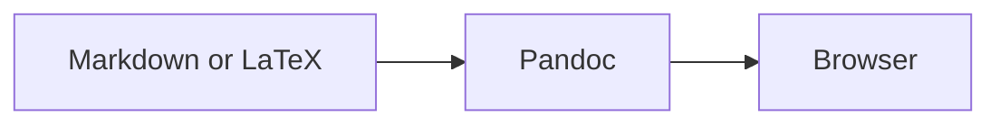
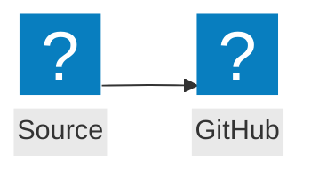

# pandoc-glance

`pandoc-glance` renders Markdown and LaTeX files as high-fidelity browser previews. Pandoc handles document conversion; `pandoc-glance` adds theme-aware styling, syntax highlighting, Mermaid, selective MathJax fallback, local resources, and save-based live reload.

Run it once to open a generated preview, or use `--watch` to refresh the same browser tab whenever the source file is saved.


## Prerequisites

- [Node.js](https://nodejs.org/) 22 or newer
- [Pandoc](https://pandoc.org/) on `PATH`

Install Pandoc on macOS with:

```bash
brew install pandoc
```

On Debian/Ubuntu, use `sudo apt install pandoc`. On Windows, use `winget install --id JohnMacFarlane.Pandoc`. If Pandoc is installed elsewhere, set `PANDOC_PATH` to the executable.

## Install from source

```bash
git clone https://github.com/omaclaren/pandoc-glance.git
cd pandoc-glance
npm install
npm run build
npm link
```

The package is not published to npm. `npm link` exposes the local compiled executable as `pandoc-glance`.

Without linking, run the compiled CLI directly:

```bash
node dist/cli.js --no-open README.md
```

## Usage

```text
pandoc-glance [options] <file>
pandoc-glance --watch [options] <file>
pandoc-glance <file> --watch
```

| Option | Meaning |
|---|---|
| `-w, --watch` | Start a live preview server and re-render after saved changes |
| `--no-open` | Do not launch a browser; print the generated path or preview URL |
| `--theme auto\|light\|dark` | Browser theme; default `auto` follows `prefers-color-scheme` |
| `--format auto\|markdown\|latex` | Input format; default `auto` uses the file extension |
| `--font-size <px>` | Base document font size from 10 to 24; default 15 |
| `--port <number>` | Watch-server port; `0` or omission chooses an available port |
| `-h, --help` | Show help |
| `-v, --version` | Show the version |

Automatic format detection recognizes common Markdown extensions (`.md`, `.markdown`, `.mdown`, `.mkd`, `.qmd`, and `.rmd`) and standalone LaTeX (`.tex` and `.latex`). Use `--format` for another extension.

### One-shot preview

```bash
pandoc-glance notes.md
pandoc-glance paper.tex --theme light --font-size 16
```

One-shot mode writes a cached HTML file and opens it in the default browser. The cache keeps at most 30 previews.

For headless or SSH use:

```bash
pandoc-glance --no-open notes.md
# HTML: /path/to/cache/<id>.html
```

### Watch mode

```bash
pandoc-glance --watch notes.md
pandoc-glance notes.md --watch --theme auto
pandoc-glance --watch --no-open --port 0 notes.md
```

Watch mode:

- Opens one browser tab and updates it after each saved change.
- Handles ordinary writes and atomic saves.
- Preserves reading position across reloads.
- Keeps the last successful preview visible after a render error and recovers on the next valid save.

Watch mode sees files on disk, not unsaved editor buffers. Enable autosave for faster updates. If the initial render fails, the error page stays open and waits for a valid save. Stop the server with Ctrl-C.

## Rendering examples

### Math

All of these forms are supported in Markdown:

```markdown
Inline dollar math: $E = mc^2$.

Inline parenthesized math: \(a^2 + b^2 = c^2\).

$$
\int_0^1 x^2\,dx = \frac{1}{3}
$$

\[
\mathbf{A}\mathbf{x} = \mathbf{b}
\]
```

Pandoc emits native MathML when possible. The browser loads MathJax only for equations that Pandoc leaves as TeX.

### Mermaid

````markdown

````

Mermaid runs in the preview page and loads only when a `mermaid` fence is present. No local Mermaid package or Mermaid CLI (`mmdc`) is required.

Flowchart icon nodes support `lucide:*` and `logos:*`. Keep each icon declaration on one source line:

````markdown

````

If Mermaid or an icon pack cannot load, the preview shows the error and the original diagram source.

### Local resources and Obsidian images

Relative paths resolve from the source document's directory:

```markdown


![[figures/result.png|Obsidian-style caption]]
```

Absolute local image paths are also supported. Watch mode uses revisioned, non-cached resource URLs so saved image changes appear immediately.

### Standalone LaTeX

A `.tex` or `.latex` file is read as a complete LaTeX document:

```latex
\documentclass{article}
\usepackage{amsmath}
\begin{document}
\section{Example}
Inline math $x^2$ and display math
\[
  \int_0^1 x^2\,dx = \frac{1}{3}.
\]
\end{document}
```

Previewing LaTeX does not run a TeX engine; Pandoc converts supported document structure and equations directly to HTML5/MathML.

## Editor and shell integration

Launch watch mode from any editor or task runner that can invoke a shell command:

```bash
pandoc-glance --watch "/absolute/path/to/current-file.md"
```

### Zed

Add this task to `.zed/tasks.json` in a project or to Zed's global tasks file:

```json
[
  {
    "label": "Preview current Markdown/LaTeX file",
    "command": "pandoc-glance",
    "args": ["--watch", "$ZED_FILE"],
    "cwd": "$ZED_WORKTREE_ROOT",
    "use_new_terminal": true,
    "allow_concurrent_runs": false,
    "reveal": "always",
    "save": "current"
  }
]
```

Run **Preview current Markdown/LaTeX file** from Zed's task picker. With autosave enabled, the browser updates shortly after edits.

### Other examples

- VS Code tasks can pass `${file}`.
- Vim and Neovim commands can pass the current buffer's expanded filename after writing it.
- Over SSH, use `--watch --no-open` and forward the printed port when remote browser access is needed.
- Scripts and CI checks can use one-shot `--no-open` without launching a GUI.

The server binds to `127.0.0.1`, so remote access requires an explicit tunnel such as `ssh -L`.

## Network use

Pandoc conversion, styling, native MathML, syntax highlighting, local resources, and live reload are local. The browser downloads these optional components as needed:

- Mermaid 11.16 from jsDelivr when the document contains a Mermaid block.
- Lucide or Logos icon data from unpkg when a diagram uses that pack.
- MathJax 3 from jsDelivr when Pandoc leaves an equation as TeX.

Without network access, the core preview still works. Mermaid remains visible as source with an error, and unsupported equations remain as TeX with a warning.

## Security model

Watch mode:

- Binds only to `127.0.0.1`.
- Uses a random 192-bit token in every preview route.
- Sets `no-store`, `nosniff`, no-referrer, same-origin, and content-security headers.
- Rejects path traversal, including encoded `..` and symlinks outside the source directory.
- Serves an outside absolute file only when the current document explicitly references it, through an opaque ID.

A failed render keeps the previous HTML and resource allowlist.

## Troubleshooting

### Pandoc was not found

Confirm installation:

```bash
pandoc --version
```

Or select a binary explicitly:

```bash
PANDOC_PATH="/custom/path/pandoc" pandoc-glance notes.md
```

The CLI validates Pandoc before starting and exits nonzero when it is unavailable.

### The browser did not open

Use `--no-open` and open the printed HTML path or URL manually:

```bash
pandoc-glance --no-open notes.md
pandoc-glance --watch --no-open notes.md
```

The CLI uses the operating system default-browser command (`open`, `xdg-open`, or Windows `start`); it does not hard-code a browser.

### A local image is missing

- Check the path relative to the source file, not the shell's current directory.
- Put paths containing spaces or parentheses in Markdown angle brackets.
- In watch mode, a relative symlink whose target is outside the document directory is deliberately blocked; use an explicit absolute path if that file should be allowlisted.
- Save the image and source file. Resource responses are not browser-cached.

### The selected port is busy

Omit `--port` or use `--port 0` to let the operating system choose an available loopback port.

## Development

```bash
npm install
npm run typecheck
npm test
npm run build
```

The test suite uses real Pandoc but does not open a browser or access the public network.

A representative fixture is available at [`test/fixtures/sample.md`](test/fixtures/sample.md), with a standalone LaTeX companion at [`test/fixtures/sample.tex`](test/fixtures/sample.tex).

For a manual headless smoke test:

```bash
node dist/cli.js --watch --no-open test/fixtures/sample.md
```

Fetch the printed loopback URL, save an edit to the fixture or a temporary copy, and observe the revision change. Press Ctrl-C to stop it.

## License

MIT. The rendering palettes and selected normalization/browser-preview patterns were adapted from the MIT-licensed [`pi-markdown-preview`](https://github.com/omaclaren/pi-markdown-preview) implementation; see [`LICENSE`](LICENSE).
