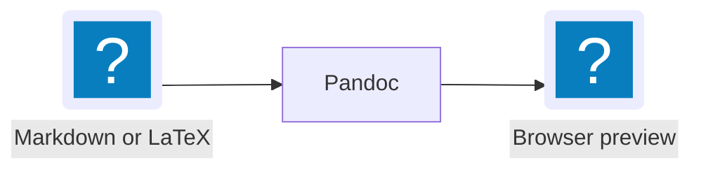

# pandoc-glance sample

This fixture exercises prose, [a link](https://example.invalid), and **Markdown** structure.

Inline dollar math: $E = mc^2$.

Inline parenthesized math: \(a^2 + b^2 = c^2\).

Display dollar math:

$$
\int_0^1 x^2\,dx = \frac{1}{3}
$$

Display bracket math:

\[
\mathbf{A}\mathbf{x} = \mathbf{b}
\]

## Highlighted code

```typescript
interface Point {
  x: number;
  y: number;
}

const origin: Point = { x: 0, y: 0 };
```

## Mermaid



## Local resources

A standard relative image:


The same local file using Obsidian image syntax:

![[sample.svg|Obsidian-style local image]]

> Watch mode refreshes after this file is saved.
